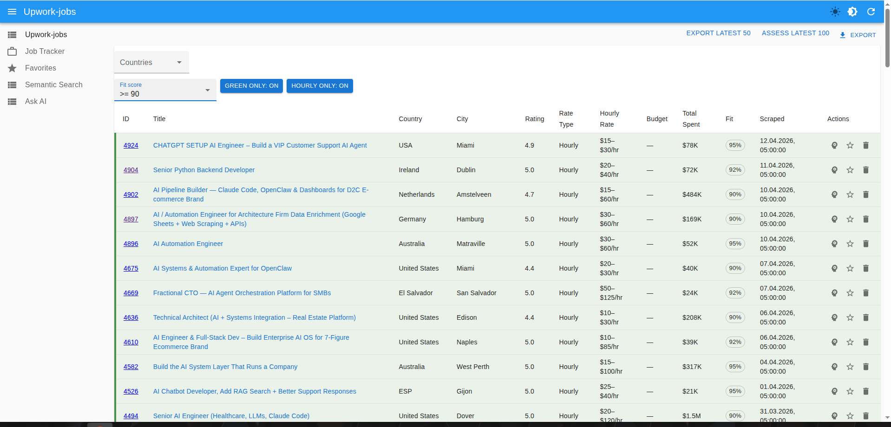
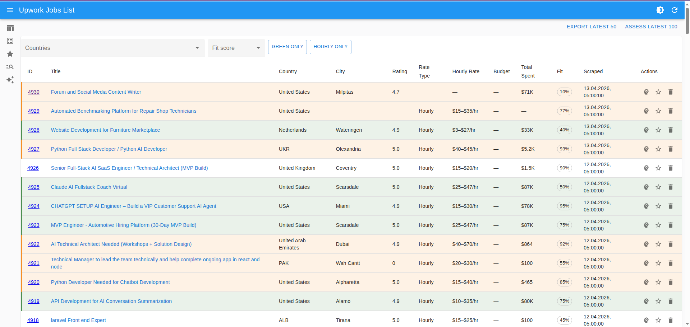

# 🚀 Upwork Admin

> AI-assisted admin panel for exploring Upwork jobs, semantic search, fit assessment, favorites, and application tracking.

[](#)
[](#)
[](#)
[](#)
[](#)
[](#license)

## ✨ Overview




**Upwork Admin** is a lightweight React Admin dashboard for working with Upwork job data through a custom backend API.

It helps you:

- browse and inspect scraped Upwork jobs
- run AI-powered semantic search
- ask questions over job data
- assess job fit for the latest jobs
- keep a favorites list
- track job applications in one place

Built for speed, simplicity, and extension.

---

## 🧩 Features

### 🔎 Upwork Jobs
- paginated job list
- country-based filtering
- rate, budget, and client metadata
- quick job inspection
- full job details page

### 🤖 AI Utilities
- **Semantic Search** over job data
- **Ask AI** interface for querying job context
- batch **fit assessment** for latest jobs

### ⭐ Favorites
- save promising jobs for quick follow-up
- keep a cleaner shortlist separate from the main feed

### 📌 Job Applications Tracker
- create and manage application records
- track submission and response statuses
- store notes, recruiter info, source, and links

---

## 🖼️ Screens / Modules

- **Upwork Jobs**
- **Favorites**
- **Semantic Search**
- **Ask AI**
- **Job Applications**

---

## 🛠 Tech Stack

- **React 19**
- **TypeScript**
- **Vite**
- **React Admin**
- **Material UI**
- Custom backend API via `VITE_API_URL`

---

## 📂 Project Structure

```bash
src/
├── components/
├── layout/
├── providers/
├── resources/
│   ├── upworkJobs/
│   └── jobApplications/
├── types/
└── utils/
```

---

## ⚙️ Getting Started

### 1. Clone the repository

```bash
git clone https://github.com/your-username/upwork-admin.git
cd upwork-admin
```

### 2. Install dependencies

```bash
npm install
```

### 3. Configure environment

Create a `.env` file:

```env
VITE_API_URL=http://localhost:8079
```

### 4. Start development server

```bash
npm run dev
```

App will be available at:

```bash
http://localhost:5173
```

---

## 🐳 Run with Docker

```bash
docker compose up --build
```

The frontend container exposes:

```bash
http://localhost:5173
```

---

## 📡 Backend Expectations

This frontend expects a backend that provides endpoints similar to:

```bash
/api/upwork-jobs
/api/upwork-jobs/semantic-search
/api/upwork-jobs/assess-fit-latest
/api/upwork-jobs-ask
/api/job-applications
```

You can adapt the `dataProvider` and HTTP layer if your backend uses different routes.

---

## 🧪 Available Scripts

```bash
npm run dev      # start local dev server
npm run build    # production build
npm run preview  # preview production build
npm run lint     # run eslint
```

---

## 🔐 Security Notes

Before publishing publicly, review the following:

- do **not** commit `.env` files
- sanitize any external HTML before rendering it
- validate external URLs before injecting them into links
- keep API credentials strictly on the backend

---

## 🚧 Roadmap

- authentication
- saved search presets
- better job scoring
- proposal generation workflows
- application analytics dashboard
- backend connector templates

